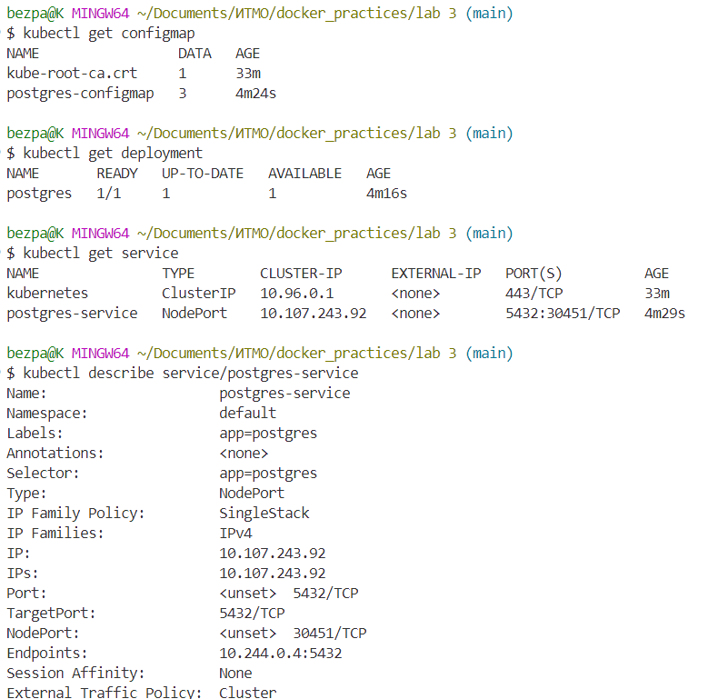
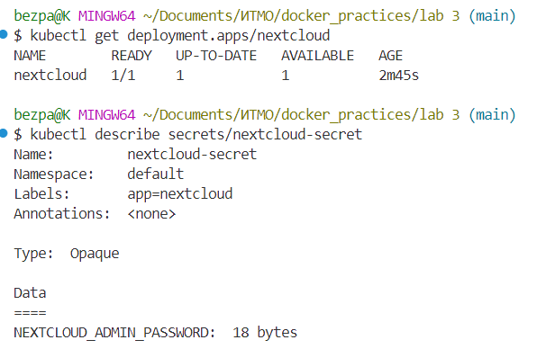
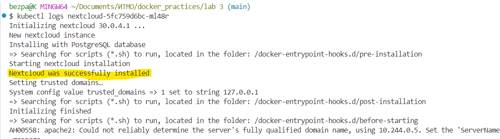
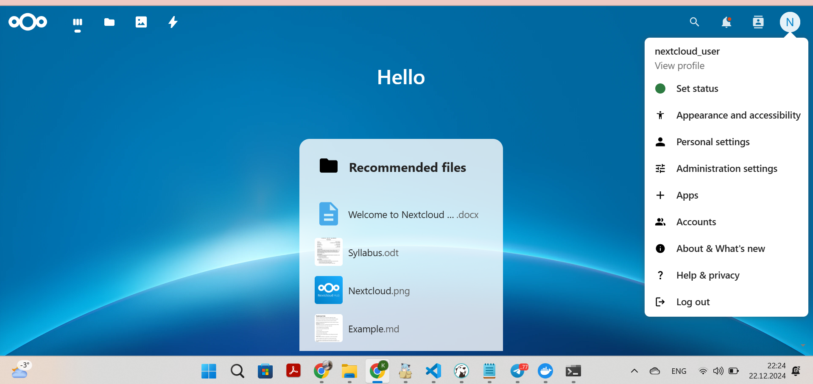
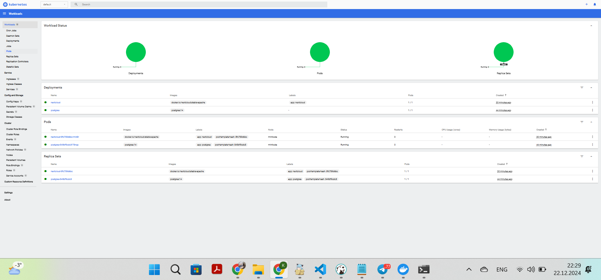
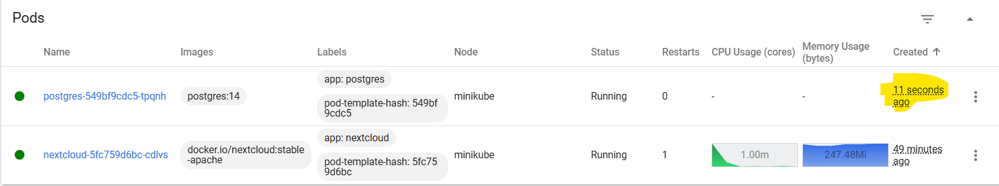

После установки minikube и создания манифестов, были созданы объекты с помощью ```kubectl create -f ...```

После этого таким же образом были созданы объекты nextcloud. 

Потом было проверено его состояние с помощью ```kubectl logs ...```

и осуществлен доступ к интерфейсу через ```kubectl expose deployment nextcloud --type=NodePort --port=80```
и последующим ```minikube service nextcloud```

Также был установлен доп.компонент dashboard через ```minikube dashboard --url```

Если отскейлить количество реплик postgres-deployment в 0, затем обратно в 1, в nextcloud можно было видеть перезапуск пода: 

После этого были сделаны все задания, результат которых можно найти в папке edited_ymls (перенесены POSTGRES_USER и POSTGRES_PASSWORD из конфигмапы в секреты, для некстклауда перенесены его переменные NEXTCLOUD_UPDATE, ALLOW_EMPTY_PASSWORD и NEXTCLOUD_TRUSTED_DOMAINS из деплоймента в конфигмапу, добавлены Liveness и Readiness пробы в nextcloud.yml).
Ответы на вопросы в соответствующем текстовом файле.

