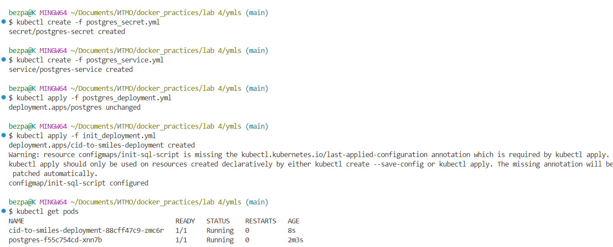
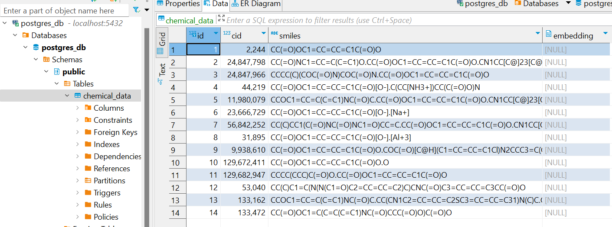

## Minikube deployment

**В папке ymls находятся необходимые манифесты:**

1. postgres-service.yml: 
Сервис для postgres БД.

2. postgres-secret.yml: 
Переменные окружения для postgres БД: название, пользователь и пароль.

3. postgres_deployment.yml:
Деплоймент с postgres.

4. init_deployment.yml:
    - Конфигмап с SQL-скриптом для создания таблицы.
    - initContainer, выполняющий этот скрипт
    - Контейнер из кастомного образа приложения для получения SMILES по CID, которые пользователь должен положить в файл input.csv в текущей директории. Перед запуском деплойментов нужно выполнить команду для создания конфигмапа из вашего input.csv:

```
kubectl create configmap cid-csv --from-file=input.csv
```

Далее нужно создать объекты секрет и сервис:

```
kubectl create -f postgres_secret.yml
kubectl create -f postgres_service.yml
```

После этого можно создавать деплойменты:

```
kubectl create -f pg_deployment.yml
```

```
kubectl create -f cid_to_smiles_deployment.yml
```



Чтобы иметь возможность подключиться к базе данных через localhost, нужно выполнить следующую команду:

```
kubectl port-forward svc/postgres-service 5432:5432
```
